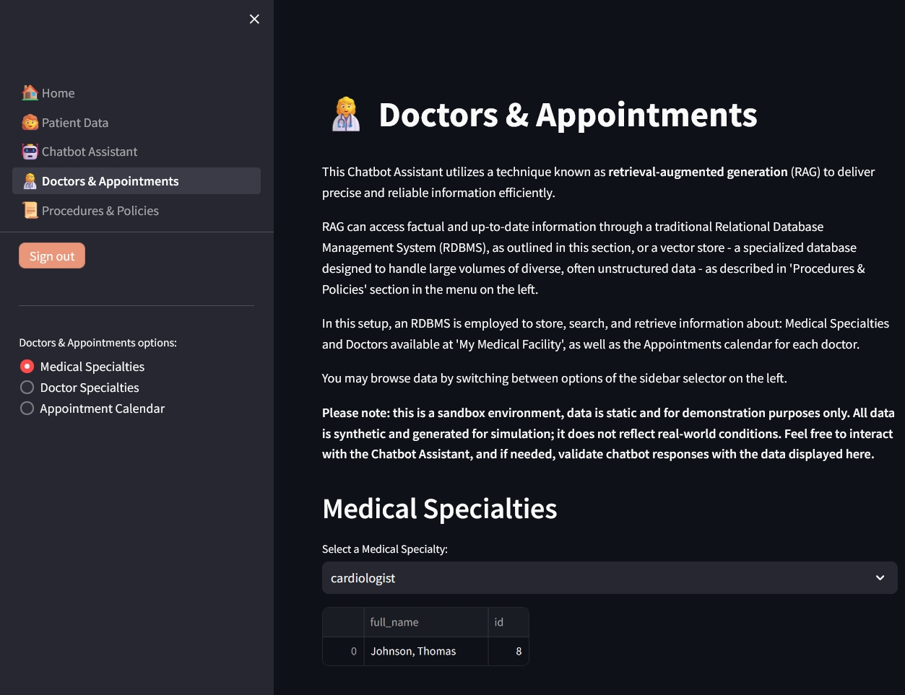

# Medical Facility Chatbot Assistant

Welcome to the "Medical Facility Chatbot Assistant," a sandbox demo application for the fictitious "My Medical Facility". This app demonstrates the potential integration of an AI based chatbot assistant in a medical setting, facilitating patient interactions, such as exploring treatments, pricing, policies or booking appointments.

## Features
- **Model Flexibility:** Currently, users can choose between various models, including OpenAI's GPT-3.5 and GPT-4, or their combination. The codebase also supports integration with open-source models such as Meta Llama 2.
- **Cost Tracking:** The app offers real-time cost tracking for commercial models, calculating expenses based on token usage.
- **Multi-source Information Retrieval:** Utilizes SQLite and Pinecone databases to ensure data is factually accurate and up-to-date.
- **Multiple Language Support:** While the chatbot's core intelligence operates in English, it includes translation layers for Polish and German. 
- **Debugging options:** The app includes options to debug the current 'session' state and information retrieved through RAG. 

## Functional components
1. **Home:** A welcoming screen that introduces the features of the chatbot assistant, designed to orient users effectively.

2. **Patient Data:** Users can input personal details for a customized experience or opt for default settings to proceed.

3. **Chatbot Assistant:** The core interaction hub where users engage with the chatbot assistant to discuss and inquire about medical services.

4. **Doctors & Appointments:** Allows users to explore data available to the chatbot assistant in the SQLite database, including medical specializations and doctors working at the medical facilities. It also displays doctors' availability as part of the sandbox environment to test and verify automatic information retrieval.


5. **Procedures & Policies:** Provides information on the unstructured data accessible to the chatbot assistent, primarily including medical procedures and various policies implemented at the medical facility. This component allows testing / verification of automatic information retrieval capabilities. 

## Architecture
The app operates using a core conversational AI, either a commercial or an open-source model, to interact with users. A critical component is the 'Orchestration Intelligence,' which analyzes and maintains the context of the conversation, focusing on subjects and timing. It also provides factual data to the 'Conversational Intelligence' via retrieval-augmented generation (RAG). This architecture not only ensures that the chatbot remains accurate and grounded in reality but also helps control operational costs.


### Technology stack:
- Models: OpenAI GPT-4, GPT-3.5, Llama 2
- Database Management: SQLite, Pinecone
- Containerization: Docker
- Cloud Platform: AWS (Linux-based)
- Authentication: Amazon Cognito
- Web Framework: Streamlit
- Programming Language: Python
- Fine-tuning: PyTorch, Hugging Face, LoRA, quantization

## Installation
This app is deployed on AWS, utilizing Docker for containerization and Amazon Cognito for authentication. General steps to install and configure the app are as follows:
1. Build the Docker image using the provided Dockerfile. This Dockerfile includes a sparse checkout with SSH (necessary when the repository was private). Be sure to adjust these settings according to your project's current needs.
```bash
docker build --build-arg SSH_PRIVATE_KEY="$(cat path_to_your_key)" -t your_tags .
```
2. Set up AWS instance and Cognito User Pool in AWS Console
3. Create .env file and add your Open AI, Pinecone, and AWS Cognito credentials.
```bash
OPENAI_API_KEY=xxx
PINECONE_API_KEY=xxx
COGNITO_DOMAIN="https://xxx.auth.xxxregionxxx.amazoncognito.com"
CLIENT_ID=xxx
CLIENT_SECRET=xxx
APP_URI="your domain or http://localhost:8501/"
```
4. Go to your AWS instance, pull the image from the hub and run the container

```bash
docker run --name container_name -d -v $(pwd)/.env:/app/.env -p 127.0.0.1:8501:8501 docker_account_name/repo_name:tag_name
```

## Dataset
This repository includes a subset of a synthetic dataset used to fine-tune open-source models for accurately handling diverse user inquiries. The dataset features dialogues in both English and Polish, simulating interactions typical of a medical facility's hotline. Additionally, the repository provides scripts for fine-tuning Meta Llama 2 models using the Hugging Face library and LoRA technology.

## Licensing
This project utilizes a dual licensing model:
- GNU GPL v3.0: This open-source license permits commercial use but mandates that any derivatives also be distributed under the same terms.
- Commercial License: Intended for proprietary applications without the obligation to release the source code. For commercial licensing inquiries, please contact manduk.ai.

For detailed information on the resources used in this application and their specific licenses, refer to the RESOURCE-LICENSES file.

## Final remarks
As a work in progress, this project is primarily a demonstration of potential capabilities rather than a finished product. Continuous improvements in reliability, functionality, and quality are planned.

## Contact
For inquiries, please reach out at manduk.ai.
